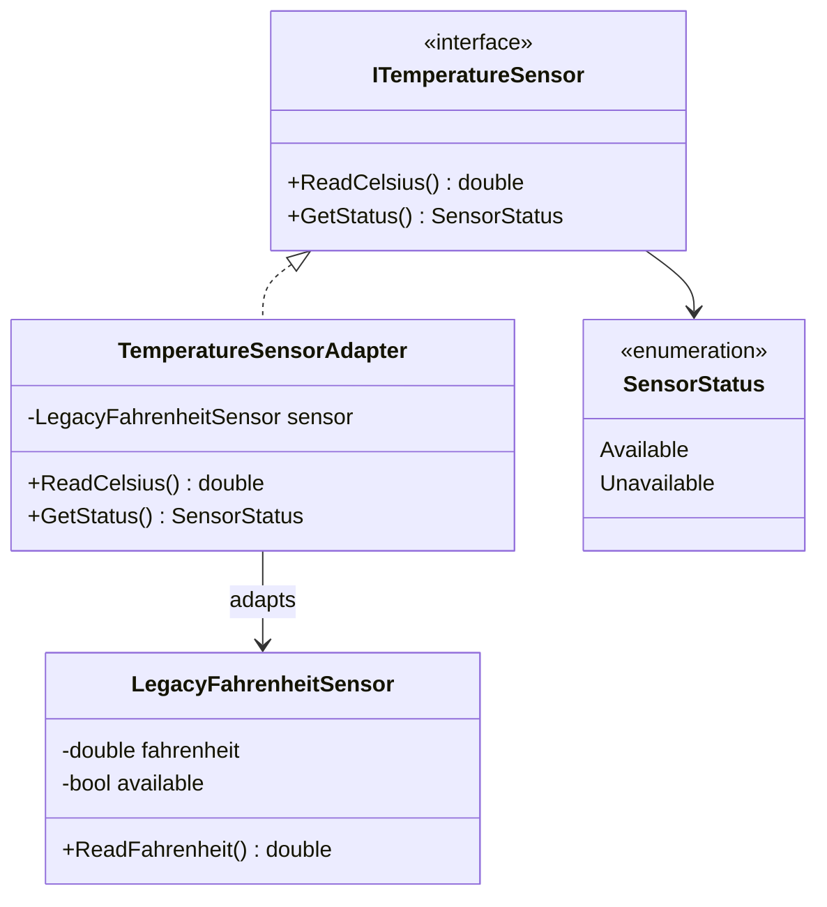

# Legacy Temperature Sensor Adapter

## Architecture

The design has four roles:

1. **Target — `ITemperatureSensor`**: the contract expected by new application code.
2. **Adaptee — `LegacyFahrenheitSensor`**: the existing class with the incompatible Fahrenheit API.
3. **Adapter — `TemperatureSensorAdapter`**: translates calls and data between the two APIs.
4. **Client — test code / future application services**: works only with `ITemperatureSensor`.

### Class diagram



The important dependency direction is that the **client sees the target interface**, not the legacy class. Only the adapter knows how the legacy API works.

## Implementation

The core conversion is:

```csharp
public double ReadCelsius()
{
    return (_sensor.ReadFahrenheit() - 32.0) * 5.0 / 9.0;
}
```

The adapter owns this translation. No other application class needs to know the Fahrenheit formula.

Null dependency validation is performed in the constructor:

```csharp
_sensor = sensor ?? throw new ArgumentNullException(nameof(sensor));
```

This fails fast if an adapter is constructed without an adaptee.

## Testing strategy

The tests use xUnit and cover both normal behaviour and boundary behaviour.

| Test | Purpose |
|---|---|
| 32°F → 0°C | Freezing-point conversion boundary |
| 212°F → 100°C | Boiling-point conversion boundary |
| 77°F → 25°C | Typical room-temperature conversion |
| Available status | Successful legacy operation is mapped correctly |
| Unavailable status | Legacy failure is mapped correctly |
| Null constructor argument | Defensive dependency validation |

The conversion tests use a tolerance of six decimal places to avoid treating floating-point arithmetic as exact beyond the useful precision for this small application.

### Expected test summary

**6 tests** covering conversion, status translation, and invalid construction. A successful run should report 6 passed and 0 failed.

##### ***Used ChatGPT for Documentation of File: README.md***